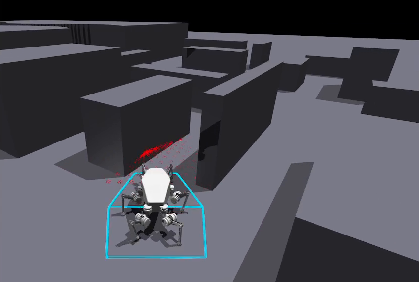
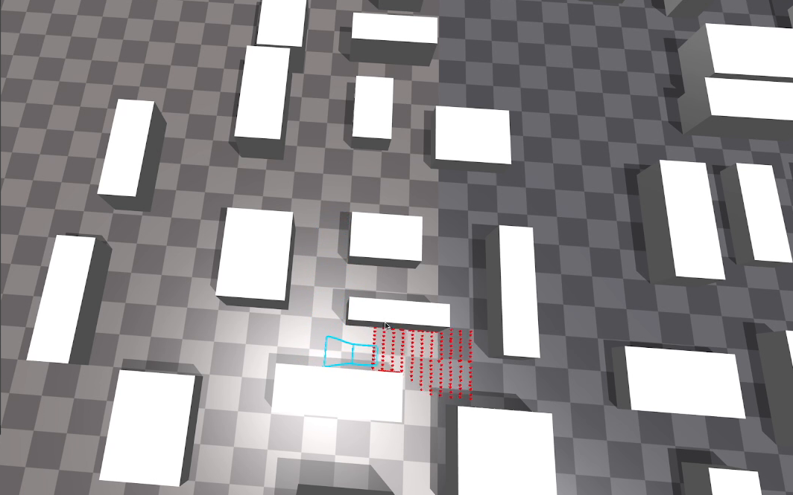
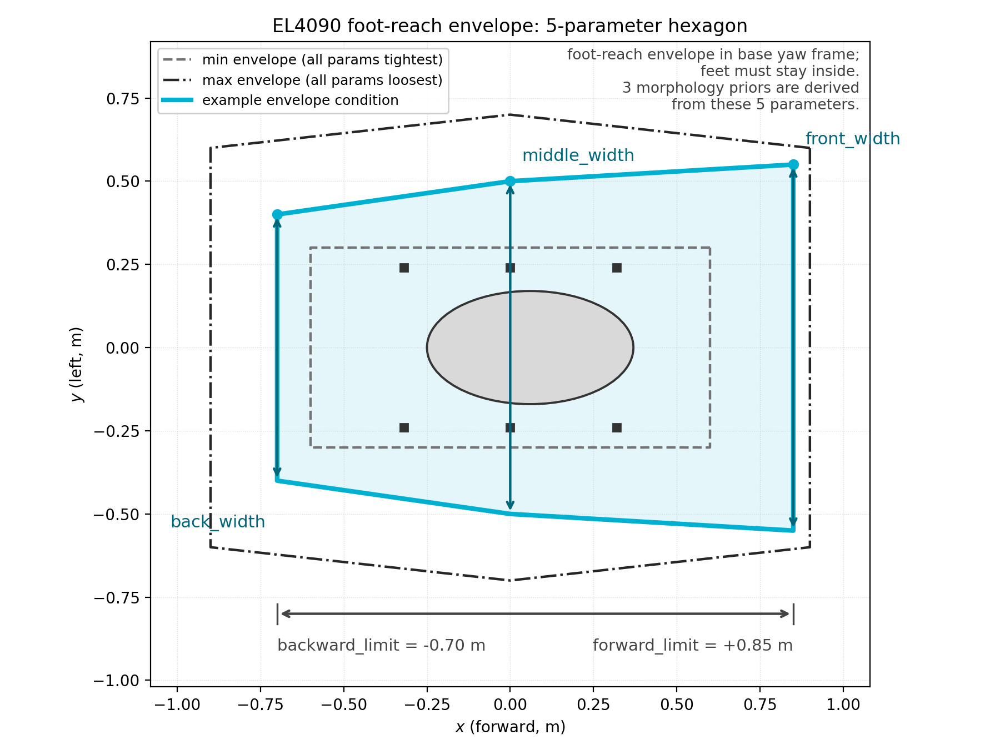
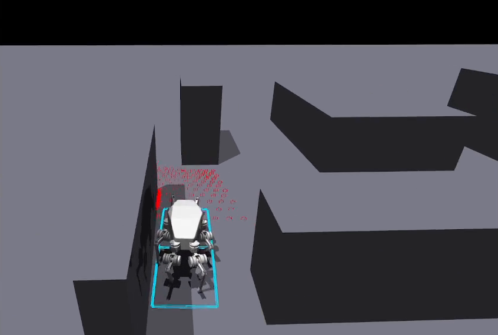

# EL4090 Adaptive Envelope Locomotion

English | [简体中文](README_zh.md)

<div align="center">
  
  
</div>

> [!WARNING]
> This repository is under active development. Per-task documentation lives inside
> each task package and may lag behind the code. Real-robot deployment is work in
> progress; all results shown here are from simulation.

This repository develops **variable adaptive envelope behavior** for the EL4090
hexapod robot, built on top of an extended [legged_gym](https://github.com/leggedrobotics/legged_gym)
fork (see [Repository basis](#repository-basis)). The foot-reachable region of the
robot is described by a five-parameter planar **envelope**. A perception module
shrinks and expands this envelope according to obstacles seen by the front LiDAR,
and a locomotion policy walks while keeping its feet inside the envelope. The two
modules are trained separately and combined into a single 50 Hz inference chain
(**cascade**).

<div align="center">
  <video controls muted loop playsinline width="70%">
    <source src="doc/figures/cascade83_demo.mp4" type="video/mp4">
  </video>
  <p><sub><code>envelope_cascade_83</code>: the full chain — perception, envelope, and gait — walking through a cluttered obstacle course (simulation).</sub></p>
</div>

## The Envelope Concept

The envelope is a hexagon in the robot's base-yaw frame, parameterized by five
lengths (all left/right symmetric):

| Parameter | Range (m) | Meaning |
| --- | ---: | --- |
| `front_width` | [0.3, 0.6] | half-width of the allowed foot region at the forward edge |
| `middle_width` | [0.3, 0.7] | half-width at the middle edge |
| `back_width` | [0.3, 0.6] | half-width at the backward edge |
| `forward_limit` | [0.6, 0.9] | forwardmost x boundary |
| `backward_limit` | [-0.9, -0.6] | rearmost x boundary (negative) |

The five geometry parameters plus three **morphology priors** derived from them
(one per leg pair, 0 = spider-like, 1 = mammal-like) form the 8-dimensional
**envelope condition** shared by all modules. The priors do not only penalize
out-of-envelope footsteps: they interpolate the default joint posture between the
spider and mammal presets and the commanded base height between 0.53 m and 0.64 m,
so the envelope directly shapes the body form the robot adopts.

<div align="center">
  
</div>

## System Architecture

The system is intentionally split into two independently trained modules plus a
thin integration layer:

- **Envelope module (perception, point cloud → envelope).** A 187-channel range
  image (11 × 17 grid covering x ∈ [0.65, 3.65] m, y ∈ [-1, 1] m ahead of the
  robot) plus 3-dim ego-motion is consumed by a GRU policy that outputs the five
  envelope parameters. Perception refreshes at 10 Hz while the controller runs at
  50 Hz; the GRU's memory covers obstacles that have left the sensor cone.
- **Robot-side module (envelope → locomotion).** The envelope condition sets the
  morphology preset (default joint posture and base height) and, through a small
  HAA-range network, per-leg abduction joint ranges used by shaping rewards. The
  locomotion policy maps its own observation to 18 joint-position residuals on top
  of the preset; the envelope itself is deliberately **not** part of its observation,
  which yields a robust policy rather than an envelope-conditioned one.
- **Cascade (integration).** Both modules are frozen and wired into one chain:
  range image + ego-motion → EA2 GRU policy (190 → 5) → bridge to the 8-dim
  condition → HAA network + morphology preset → SE2 gait policy (68 or 83 → 18) →
  robot. A single switch (`ea2.enable=False`) falls back to pure SE2 behavior with
  randomly sampled envelopes.

## Task Overview

All tasks live under `legged_gym/legged_gym/envs/el_4090/`. Each entry lists the
name registered with `task_registry` and the policy observation dimension.

| Lineage | Task | Registry name | Policy obs | Status |
| --- | --- | --- | ---: | --- |
| Envelope module v1 | `envelope_adaptive` | `el4090_ea` | 74 | Fused analytic pipeline (LiDAR → avoidance planner → envelope), no trained envelope model; superseded by v2, kept for reference |
| Envelope module v2 | `envelope_adaptive_2` | `el4090_ea2` | 190 | **Mainline.** Standalone trainable perception; supervised learning pipeline + optional PPO finetune; weights `v2_multik`, `v3_attitude` |
| Robot side v1 | `spider_envelop` | `el4090_envelop` | 74 | Legacy v1: condition-visible policy (8-dim condition in obs) |
| Robot side v2 | `spider_envelop_2` | `el4090_envelop_2` | 68 | **Mainline.** Hidden-condition policy + HAA-range network; 68-dim locomotion policy training in progress (source of the cascade_68 gait weights) |
| Cascade, 83-dim | `envelope_cascade_83` | `el4090_cascade_83` | 83 | **Complete, current best.** Frozen 83-dim contract, all weights pinned, closed-loop acceptance passed |
| Cascade, 68-dim | `envelope_cascade_68` | `el4090_cascade_68` | 68 | Newer 68-dim contract; contract + perception tests pass; walking acceptance pending the 68-dim gait weights |

## Envelope Module

**v1 (`envelope_adaptive`) — fused, not independently trainable.** The full Airy
LiDAR is processed analytically inside the robot environment: an angular-distance
curve with spline peak finding selects an avoidance direction, and a fan-sector
detector drives a symmetric step-based shrink/grow law for the five envelope
parameters. The envelope is tightly coupled to the locomotion loop, so the
envelope logic itself has no trainable model and cannot improve from data. It
remains registered as `el4090_ea` for reference only.

**v2 (`envelope_adaptive_2`, "EA2") — standalone trainable perception.** The
envelope problem is lifted into a simplified environment without a robot body:
motion is scripted (A* path + speed schedule), which makes the state transition
independent of the actions and turns the learning problem into clean supervised
regression against a geometric oracle.

- **Oracle**: computed from the global distance field (axis march with 0.20 m
  margin → soft caps on the expanded sides → active-set joint shrink →
  rate-limited smoothing that closes fast and opens slowly), giving dense,
  collision-free targets on every geometrically feasible frame.
- **Learning (mainline)**: sliding-window MSE with multi-scale recall auxiliary
  heads (forcing the GRU to remember obstacles that left the view) and a
  differentiable safety loss on the distance field. The released recipe
  (`v2_multik`) reaches val R² ≈ 0.75; the `v3_attitude` variant is retrained on a
  corpus with continuous body-attitude replay (val R² = 0.7375), fixing spurious
  envelope collapses caused by real-robot pitch motion.
- **Export**: the normalized network output is folded into the raw-action space by
  rewriting the actor's last layer, so deployment needs no pre/post-processing.
  Optional PPO finetune resumes from the exported weights.

<div align="center">
  <video controls muted loop playsinline width="70%">
    <source src="doc/figures/ea2_envelope_gru_demo.mp4" type="video/mp4">
  </video>
  <p><sub>EA2 running in the simplified pillar environment: red LiDAR returns, cyan envelope adapting to the obstacles ahead (no robot body in this task).</sub></p>
</div>

Details, training recipe, evaluation metrics, and known issues:
[envelope_adaptive_2/README.md](legged_gym/legged_gym/envs/el_4090/envelope_adaptive_2/README.md).

## Robot-Side Module

**v1 (`spider_envelop`) — condition-visible policy.** The 8-dim envelope condition
is part of the 74-dim observation, and an `envelope_constraint` reward penalizes
feet outside the hexagon. The policy is therefore explicitly envelope-conditioned.
A ground-footprint debug view draws the current envelope contour around the robot.

**v2 (`spider_envelop_2`) — hidden-condition policy (mainline).** The policy
observation shrinks to 68 dimensions (base velocities, gravity, velocity commands,
joint positions relative to the *condition-dependent* default posture, joint
velocities, last actions, gait phase). The envelope, morphology priors, and HAA
ranges are internal only:

- `embedded_state_default_dof_pos` interpolates the default joint posture and base
  height from the morphology priors, so the control center moves with the envelope
  even though the policy never sees it.
- The HAA-range network (MLP, 8-dim input → per-leg `[lower, upper]`) is refreshed
  whenever the envelope changes; its outputs drive the `haa_range_violation` and
  `haa_phase_tracking` shaping rewards.

Interface details, the exact 68-dim observation layout, and the HAA network
contract: [envs/el_4090/ReadMe.md](legged_gym/legged_gym/envs/el_4090/ReadMe.md).

## Cascade Tasks

The cascades freeze both modules and wire them into one 50 Hz chain
(`ea2_perception` → `envelope_bridge` → `set_envelope_condition` → HAA network +
morphology preset → frozen SE2 policy). Each cascade vendors a frozen copy of its
SE2 environment layer (`se2_frozen/`) so upstream changes cannot silently break a
deployed contract, and pins all three weights (EA2 perception, SE2 gait policy as
TorchScript, HAA network) with md5 checksums in its `checkpoints/README.md`.

- **`envelope_cascade_83`** (frozen 83-dim contract — the 83-dim observation adds
  morphology priors and HAA-range centers/half-ranges to the 68-dim layout) is the
  most complete variant. Its closed-loop acceptance (2026-09-01) passed: standing
  mean |vx| = 0.047, commanded vx = 1.0 tracking mean vx = 0.932, and 8 s with zero
  terminations inside the pillar field. Keyboard demo: `w/s/a/d/q/e` move and turn,
  `1/2/3` gait gears, `x`/space emergency stop, `v` toggles point-cloud/envelope
  visualization, `ESC` quits.

<div align="center">
  
  <p><sub><code>envelope_cascade_83</code>: the gait policy threads a narrow gap while the EA2 perception keeps the envelope clear of the returns ahead.</sub></p>
</div>

- **`envelope_cascade_68`** is the structural twin on the current 68-dim contract
  (fully independent package; weights are not interchangeable with the 83-dim
  task). Contract and perception tests (20) and the three env-integration variants
  pass; the 68-dim SE2 gait checkpoint is still being trained, so the interactive
  demo and closed-loop walking acceptance are pending.

Task-level documentation with dependency anchors and acceptance records:
[envelope_cascade_83/README.md](legged_gym/legged_gym/envs/el_4090/envelope_cascade_83/README.md),
[envelope_cascade_68/README.md](legged_gym/legged_gym/envs/el_4090/envelope_cascade_68/README.md).

## Workflow and Commands

All commands are run from the repository root. First set up the environment:

```bash
conda activate el4090
# ninja must be on PATH for Isaac Gym's gymtorch JIT build
export PATH=/home/t3chichi/anaconda3/envs/el4090/bin:$PATH
```

### Envelope module (EA2) — full pipeline

The pipeline runs `collect → train → eval → export`, with an optional fifth
PPO-finetune stage; a one-key pipeline chains all stages together.
**Isaac Gym constraint: one
environment instance per process** — collect one map seed per process.

```bash
EA2_PKG=legged_gym.envs.el_4090.envelope_adaptive_2.sl.scripts
EA2_RUN=legged_gym/legged_gym/envs/el_4090/envelope_adaptive_2/sl/logs/runs

# 0. smoke test
python legged_gym/legged_gym/scripts/train.py --task=el4090_ea2 --num_envs=4 --max_iterations=1 --headless

# 1. one-key pipeline (collect → train → eval → export)
python -m $EA2_PKG.pipeline --run-name <name>

# or stage by stage:
python -m $EA2_PKG.collect --seeds 1 --num-envs 96          # data collection (zero-action rollout)
python -m $EA2_PKG.train --run-name <name> --epochs 50 --patience 10
python -m $EA2_PKG.train --run-name <name> --aux-ks 25,50,100,200,300   # multi-scale recall heads
python -m $EA2_PKG.eval --ckpt $EA2_RUN/<name>/model.pt     # closed-loop evaluation
python -m $EA2_PKG.export --ckpt $EA2_RUN/<name>/model.pt \
    --out $EA2_RUN/<name>/policy_init.pt --run-name <name>  # fold + package as rsl_rl checkpoint

# 2. visualization (red/green point cloud + cyan envelope)
python legged_gym/legged_gym/scripts/play_ea2.py --task=el4090_ea2 --load_run v3_attitude --checkpoint 0 --num_envs 1

# 3. optional PPO finetune from the exported weights
python legged_gym/legged_gym/scripts/train.py --task=el4090_ea2 --resume --load_run <name> --checkpoint 0
python -m $EA2_PKG.ppo_continue --arm sl_init --ckpt $EA2_RUN/<name>/model.pt --seed 1 --iterations 60 --out p.json
```

### Robot-side locomotion policy

```bash
# train (68-dim hidden-condition policy, mainline)
python legged_gym/legged_gym/scripts/train.py --task=el4090_envelop_2 --headless

# demo (also auto-exports the policy as TorchScript — the exported artifact
# is what a cascade task pins as its `policy_1.pt` gait checkpoint)
python legged_gym/legged_gym/scripts/play_envelop_2.py --task=el4090_envelop_2 --num_envs 1

# legacy v1 (condition-visible policy)
python legged_gym/legged_gym/scripts/train.py --task=el4090_envelop --headless
python legged_gym/legged_gym/scripts/play_envelop.py --task=el4090_envelop --num_envs 1
```

### Cascade demo and tests

```bash
# interactive demo, cascade_83 (weights are pinned inside the task package)
python legged_gym/legged_gym/scripts/play_cascade_83.py --task=el4090_cascade_83 --num_envs 1
#   w/s/a/d/q/e move & turn, 1/2/3 gears, x/space stop, v viz toggle, ESC quit
#   --max_steps N bounds the run (headless smoke test)

# cascade_68 demo (same interface; requires the 68-dim gait checkpoint, pending)
python legged_gym/legged_gym/scripts/play_cascade_68.py --task=el4090_cascade_68 --num_envs 1

# test suites (each runs pytest contracts/perception + three Isaac env-integration variants)
bash legged_gym/legged_gym/tests/ea2/cascade/run_cascade_tests.sh        # cascade_83
bash legged_gym/legged_gym/tests/ea2/cascade_68/run_cascade68_tests.sh   # cascade_68

# closed-loop acceptance (standing stability + vx=1.0 walking)
python legged_gym/legged_gym/tests/ea2/cascade/run_cascade_closed_loop_test.py
python legged_gym/legged_gym/tests/ea2/cascade_68/run_cascade68_closed_loop_test.py
```

## Test and Acceptance Status

Unit suites re-run on 2026-09-06 (this repository, clean tree at `040340c`);
integration and closed-loop statuses are from the dated task documents.

| Suite | Command | Result |
| --- | --- | --- |
| EA2 full unit suite | `bash legged_gym/legged_gym/tests/ea2/run_ea2_tests.sh` | **287 passed, 10 skipped** (2026-09-06) |
| cascade_83 contracts + perception | step [1/4] of `run_cascade_tests.sh` | **18 passed** (2026-09-06) |
| cascade_68 contracts + perception | step [1/4] of `run_cascade68_tests.sh` | **20 passed** (2026-09-06) |
| cascade_83 env integration (main / `--ea2-off` / midpoint) | steps [2–4/4] | PASS (2026-09-01) |
| cascade_83 closed-loop | `run_cascade_closed_loop_test.py` | PASS (2026-09-01) — see numbers above |
| cascade_68 env integration (main / `--ea2-off` / midpoint) | steps [2–4/4] | PASS (2026-09-04) |
| cascade_68 closed-loop | `run_cascade68_closed_loop_test.py` | pending 68-dim gait weights |

EA2 also ships G0–G5 acceptance gates and diagnostic probes (oracle audit,
pass-by expansion analysis, stop-forgetting probe); see
[envelope_adaptive_2/README.md](legged_gym/legged_gym/envs/el_4090/envelope_adaptive_2/README.md) §7.

## Known Limitations and Roadmap

- **Front-only perception**: the 187 channels cover x ∈ [0.65, 3.65] m, y ∈ [-1, 1] m;
  obstacles beside/behind the robot live only in GRU memory. Holding still against
  an obstacle for ≫ 3 s lets the envelope slowly reopen (rate reduced ~8× and
  saturated by the speed-mix corpus). Planned: channel redistribution to side
  strips; deployment guard: freeze the envelope when ego-motion ≈ 0.
- **Training domain**: EA2 was trained at vx ∈ [0, 1], vy ≈ 0, flat ground with
  pillars; commands outside this domain are out-of-distribution. Attitude replay
  (`v3_attitude`) fixed the real-robot pitch artifact; height/sway randomization
  (`SwayCfg`/`HeightCfg`) is the next step.
- **Terrain geometry mismatch**: Isaac-side pillars are 0.1 m heightfield steps
  while EA2's training maps are exact box meshes (±cm lateral hits).
- **cascade_68 gait weights pending**: the 68-dim SE2 policy is still training;
  until then the cascade_68 demo and closed-loop acceptance remain locked.
- **Real-robot deployment**: in progress.

## Repository Layout

```text
el4090_legged_gym/
├── legged_gym/legged_gym/
│   ├── envs/el_4090/               # EL4090 task packages (see Task Overview)
│   │   ├── envelope_adaptive/      #   envelope module v1 (fused, reference)
│   │   ├── envelope_adaptive_2/    #   envelope module v2 (EA2, mainline) + sl/ supervised pipeline
│   │   ├── spider_envelop/         #   robot side v1 (condition-visible)
│   │   ├── spider_envelop_2/       #   robot side v2 (hidden-condition + HAA network)
│   │   ├── envelope_cascade_83/    #   cascade, frozen 83-dim contract (complete)
│   │   ├── envelope_cascade_68/    #   cascade, frozen 68-dim contract (gait weights pending)
│   │   └── ReadMe.md               #   robot-side v1/v2 detailed docs
│   ├── scripts/                    # train.py, play_ea2.py, play_envelop*.py, play_cascade_*.py, ...
│   └── tests/ea2/                  # unit + integration suites, G0–G5 gates, diagnostics
├── rsl_rl/                         # vendored rsl_rl (3.3.0)
├── el4090_envelope/                # standalone envelope math & visualization package
└── doc/figures/                    # images and videos used in this README
```

## Repository Basis

This repository is an extension of [legged_gym](https://github.com/leggedrobotics/legged_gym)
and is used as a submodule of [PegasusFlow](https://github.com/MasterYip/PegasusFlow).
Infrastructure inherited from the fork and shared by the envelope tasks:

- **rsl_rl 3.3.0 support** (upgraded from 1.0.2), vendored under `rsl_rl/`.
- **Nvidia Warp SDF & raycasting**: SDF, raycasting, and depth-camera integration
  used by the EA2 perception path and the LiDAR stack.
- **Main-rollout environment architecture** for sampling-based methods, confined
  terrain generation and OBJ terrain support (see
  [leggedrobotics/terrain-generator](https://github.com/leggedrobotics/terrain-generator),
  [MasterYip/blender_robotic_utils](https://github.com/MasterYip/blender_robotic_utils)),
  gym_visualizer integration, and benchmarking tools.
- **`el4090_envelope/`**: a standalone distribution of the envelope math and
  Isaac Gym visualization examples (LiDAR free-envelope computation, legacy border
  slider). It does not load RL checkpoints; see
  [el4090_envelope/README.md](el4090_envelope/README.md) and its
  [visualization guide](el4090_envelope/docs/isaac_gym_examples.md).
- Other EL4090 environment variants kept from earlier work: `spider_nomal` (gait
  baselines), `spider_mammal` / `spider_both` (morphology variants), `safe`
  (ATACOM safety layer), `pd_gru_lidar`, `data_collect`, `thirdparty`.
